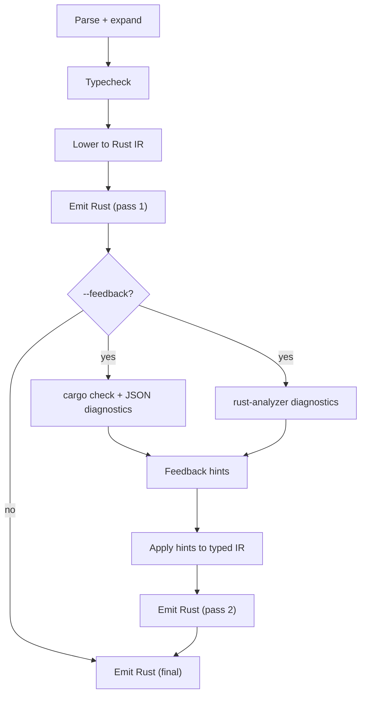

# Darcy (darcy-lang)

Darcy is a small, typed Lisp that compiles to Rust.

The compiler (`dslc`) reads `.dsl` files, typechecks them, lowers to Rust, and (optionally) runs the result.

## Quickstart

Compile a single file to Rust:

```bash
cargo run -p dslc -- examples/ok.dsl > out.rs
```

Run a file (compiles and executes):

```bash
cargo run -p dslc -- run examples/ok.dsl
```

Add stdlib/module search paths (repeatable):

```bash
cargo run -p dslc -- -L crates/darcy-stdlib/darcy examples/ok.dsl
cargo run -p dslc -- -L crates/darcy-stdlib/darcy run examples/mnist.dsl --runtime
```

Enable the feedback pass (two-stage emit + rustc diagnostics):

```bash
cargo run -p dslc -- --feedback examples/ok.dsl
```

Note: the compiler may emit warnings when it auto-clones values to avoid move errors.

## LSP (Zed + VS Code)

Install the language server binary:

```bash
cargo install --path crates/darcy-lsp
```

Zed:
- Install dev extension from `extensions/zed` (contains `extension.toml`).
- This repo includes workspace config in `.zed/settings.json` that launches `darcy-lsp` for the `Darcy` language.
- If `darcy-lsp` is not in `PATH`, replace the command with an absolute path.
- See `extensions/zed/README.md`.

VS Code:
- A local extension client lives at `extensions/vscode`.
- Setup:

```bash
cd extensions/vscode
npm install
```

- Open `extensions/vscode` in VS Code and press `F5` to run an Extension Development Host.
- The extension starts `darcy-lsp` over stdio for `.dsl` files.
- Settings:
  - `darcy.languageServer.path` (default `darcy-lsp`)
  - `darcy.languageServer.args` (default `[]`)

## Syntax Highlighting

TextMate grammars for Zed and VS Code are generated from `extensions/defs.json`:

```bash
make grammars
```

To verify they are in sync:

```bash
make grammars-check
```

Files:
- Source-of-truth metadata: `extensions/defs.json`
- Generator: `extensions/gen_grammars.py`
- Generated outputs:
  - `extensions/vscode/syntaxes/darcy.tmLanguage.json`
  - `extensions/zed/darcy.tmLanguage.json`

## Git Hooks

Install repo-managed hooks:

```bash
make hooks-install
```

Current pre-commit hook runs:
- `cargo fmt --all` (auto-formats and stages tracked files)
- `make grammars-check`
- `make test`

## Language Snapshot

Top-level forms:
- Records: `(defrecord name (field Type) ...)`
- Enums: `(defenum name (variant (field Type) ...) ...)`
- Functions: `(defn name [params] expr)`
- Macros: `(defmacro name [params] expr)`
- Inline defs: `(defin name [params] expr)` (expanded before typechecking)
- Values: `(def name expr)`

Expressions (selected):
- Literals: ints (default `i64`), floats (`f64`), strings, `true`/`false`, `nil` (`()`), keywords (`:key`)
- Control flow: `(if cond then [else])`, `(when cond expr ...)`, `(cond (test expr) ... (else expr))`
- Sequencing/binding: `(do ...)`, `(let [x 1 y 2] ...)`, `(let! x expr)` (assignment, returns `()`)
- Functions: `(fn [x] ...)`, calls: `(f a b)` (plus `(call f a b)` for dynamic calls)
- Loops: `(loop expr)`, `(while cond expr)`, `(for i (range 0 10) expr)`
- Loop control: `(break [expr])`, `(continue)`
- Field access: `u.name`
- Method calls (Rust interop-ish): `(. obj method arg ...)`, `(.method obj arg ...)`
- Case on enums: `(case x (variant (field v) expr) (_ expr))`
- Threading macros: `(-> x (f 1) g)`, `(->> xs (map f) (take 10))`
- Reader conveniences: `;` line comments, `#| |#` block comments, commas are whitespace, `#_` discards the next form

Interop (selected):
- Extern wrapper: `(extern (defrecord ...))`, `(extern (defenum ...))`, `(extern (defn name [params] RetType))`
- Rust interop macros: `(require [darcy.rust :refer [defextern defextern-record]])`

## Prelude, Operators, Overloading

Prelude:
- `darcy.core` is automatically opened in every module (except `darcy.core` and `darcy.op`).
- This means `+`, `=`, `mod`, `<`, `<=`, `>`, `>=`, `&`, `|` work as normal calls without an explicit `require`.

Operators:
- Operator spellings are aliases to `darcy.core/*` names (`+` -> `add`, `=` -> `eq`, etc).
- `darcy.core/*` is a thin layer over `darcy.op/*`.
- `darcy.op/*` are compiler-lowered primitives (they become real Rust ops in generated code).

Overloading:
- Functions can be overloaded by arity (same name, different parameter count).

## Printing And Strings

Printing:
- Debug print: `(darcy.io/dbg x)` (Rust `println!("{:?}", ...)`)
- Formatting: `(darcy.fmt/format x)`, `(darcy.fmt/pretty x)`
- Printing is variadic:
  - Template-style: `(darcy.fmt/println "x={} y={}" x y)` (lowered to Rust `println!`)
  - Value-style: `(darcy.fmt/println a b c)` prints values separated by spaces

String interpolation:
- `${name}` inside a string literal lowers to `format!(...)`.
- Example: `(darcy.fmt/println "hi ${name}")`

Records/enums printing:
- All `defrecord` and `defenum` types automatically get a Rust `Display` impl (currently backed by `Debug`),
  so `(darcy.fmt/println u)` works for user-defined types.

## Modules

```lisp
(require [darcy.io :as io])

(defn main []
  (io/dbg 42))
```

You can also:
- `(require [darcy.io :refer [dbg]])`
- `(require [darcy.io :refer :all])`

Module paths use `.` (example: `darcy.io`). Callable references use `/` (example: `darcy.io/dbg`).

Stdlib modules (selected):
- Always available (builtins): `darcy.core`, `darcy.op`, `darcy.io`, `darcy.fmt`, `darcy.option`, `darcy.result`
- Common library modules (from `crates/darcy-stdlib/darcy/`): `darcy.vec`, `darcy.string`, `darcy.math`, `darcy.tensor`, `darcy.nn`, `darcy.mnist`, `darcy.rand`

## Rust Integration

### Cargo-integrated workflow

Use the Cargo subcommand to scaffold a Rust project with Darcy integration:

```bash
cargo darcy init my-app
cd my-app
cargo run
```

This creates a normal Cargo crate with `build.rs` and a `darcy/` folder. The build step compiles Darcy sources
into Rust and includes them automatically. Darcy's stdlib comes from the `darcy-stdlib` crate by default.

If you're developing from this repo, set `DARCY_SDK` to the repo root so `cargo darcy init` uses path
dependencies to `darcy-build` and `darcy-stdlib`:

```bash
export DARCY_SDK=/path/to/darcy-lang
```

### Calling Darcy from Rust

For an automated workflow, use the `darcy-build` crate in `build.rs` so Darcy sources are compiled during
`cargo build`.

```toml
[build-dependencies]
darcy-build = { path = "path/to/darcy-lang/crates/darcy-build" }
darcy-stdlib = { path = "path/to/darcy-lang/crates/darcy-stdlib" }
```

```rust
// build.rs
fn main() {
    darcy_build::Builder::new("darcy/main.dsl")
        .lib_path("darcy")
        .stdlib_path(darcy_stdlib::stdlib_dir())
        .compile()
        .expect("darcy compile failed");
}
```

```rust
// src/main.rs
mod darcy_gen {
    include!(concat!(env!("OUT_DIR"), "/darcy_gen.rs"));
}

fn main() {
    let o = darcy_gen::Order { qty: 2, price: 3.5 };
    let total = darcy_gen::total_prices(o);
    println!("{total}");
}
```

`darcy-build` looks for the stdlib at `DARCY_STDLIB` first, then falls back to this repo's
`crates/darcy-stdlib/darcy/` directory (when used via the Darcy workspace or a path/git dependency).

## Benchmarks

There is a small benchmark stub at `dslc/src/bin/bench.rs`:

```bash
cargo run -p dslc --bin bench -- --iters 200000
```

There is also a typecheck/inference benchmark:

```bash
cargo run -p dslc --bin bench_typecheck -- --iters 10000 --save bench/typecheck.json
cargo run -p dslc --release --bin bench_typecheck -- --iters 10000 --save bench/typecheck.release.json
```

## Current Limitations

- No explicit ownership/borrowing surface syntax yet (there is inferred borrowing + auto-clone warnings)
- No user-defined traits/generics syntax (compiler infers generic bounds in some cases)
- Diagnostics are mostly single-span today



Rustc remains the source of truth for hard errors; RA provides additional type/trait insights even
when code compiles.

## Notes

The intent is: your compiler does the "clarity layer" (shape + local type inference + good errors),
and Rust remains the final checker for deep lifetime / trait issues.

Naming: DSL identifiers are lowercase kebab-case. They are normalized to Rust identifiers during lowering
(types and variants become PascalCase; values become snake_case). Callable names are a bit more permissive
(they can include characters like `?` and `!`), and all non-Rust characters are safely mangled during lowering.
Use `(extern "RustName" (def...))` to override the Rust name for extern declarations.

See `LANGUAGE.md` for the living language guide.
